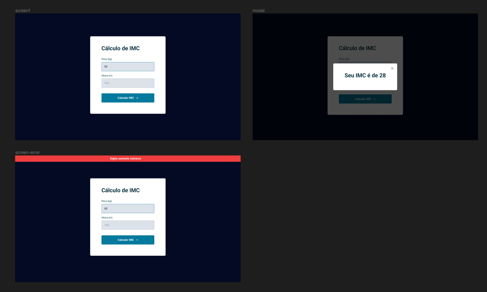

<h1 align="center"> IMC Calculator </h1>

  <a href="#-tecnologias">Tecnologias</a>&nbsp;&nbsp;&nbsp;|&nbsp;&nbsp;&nbsp;
  <a href="#-projeto">Projeto</a>&nbsp;&nbsp;&nbsp;|&nbsp;&nbsp;&nbsp;
  <a href="#-resultado">Resultado</a>&nbsp;&nbsp;&nbsp;

 

## 🚀 Tecnologias

Esse projeto foi desenvolvido com as seguintes tecnologias:

- HTML
- CSS
- JavaScript
- Figma

## 💻 Projeto

Neste desafio foi criado uma calculadora de IMC (Índice de massa corporal), no qual o usuário consegue fazer o cálculo a partir do seu tamanho e do seu peso. Temas aplicados:

- Estrutura de dados HTML
- Animações com CSS
- Funções no Javascript
- Manipulação da DOM
- Funções
- ESModules
- Design responsivo
- Clean Code (básico)

## 🎉 Extras
- O campo retorna nulo após o usuário fechar o modal do cálculo;
- Animção ao fechar o erro de alerta;
- Alerta sendo fechado após digitar novamente os valores;
  
## 📝 Proposta

  

## ✅ Resultado
- [Acesse o resultado finalizado da calculadora de IMC, online](https://devbonatto.github.io/IMCCalculator/)

## 🔖 Layout
Você pode visualizar o layout do projeto através [DESSE LINK](https://www.figma.com/file/ghbxYCRBy4pjlvArItsVUT/IMC-Copy?fuid=1369823793362288511)
